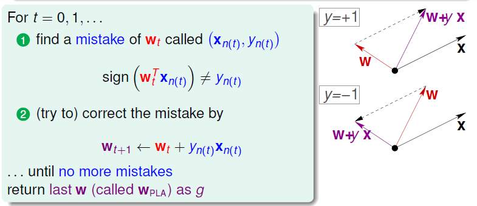

## 感知机PLA(Perceptron Learning Algorithm)

感知机是线性二分类器。

### 假设 hypothesis

以审核信用卡为例，每个客户都会有一些资料，如年龄、年收入、工作年龄等等。

有d个特征的一条数据长这样$X = (x_1, x_2, x_3,\dots,x_d)$ 我们使用这些特征算一个(加权)分数：$\sum^d_{i=1}w_ix_i$ 如果这个分数大于某个阈值就发信用卡，否则不发：

$$
如果\sum^d_{i=1}w_ix_i>threshold, 发信用卡\\

如果\sum^d_{i=1}w_ix_i<threshold, 不发信用卡
$$

发不发信用作为我们的标签label，使用$y$表示，y为1表示发信用卡，为-1表示不发，很多数据就会有很多正负样本，上面的审核条件也可以写成：

$$
\begin{aligned}
h(X) &= sign((\sum^d_{i=1}w_ix_i) - threshold)\\
&=sign((\sum^d_{i=1}w_ix_i) +(-threshold)*1)\\
&=sign((\sum^d_{i=1}w_ix_i) + w_0x_0)\\
&=sign(\sum^d_{i=0}w_ix_i)\\
&=sign(W^TX)
\end{aligned}
$$

上述推导中$-threshold$为$w_0$，也就是一般假设中的$b$，新增了一个特征$x_0=1$为了方便简化公式，最后一步转成向量内积的形式。所有的$w_i$都是我们的参数

我们的假设$h(X)$长什么样呢？在给定一组参数$w_i$的情况下，使用空间中所有的点计算$h(X)$，那么每个点都会有一个label，1或-1，在$W^TX=0$这条直线上的点的label为0，所以认为是$W^TX=0$这条直线（超平面）将空间分成了正负两部分，如图中的蓝色和粉色区域：

### 学习参数（训练）

空间中存在的直线(超平面)无线，不可能从中找一个最好的出来，想法是一开始随机选择一个直线（初始参数取随机值）,然后再慢慢修正它。但是要如何修正呢？首先，感知机演算法修正的是超平面，以$w_0+w_1x_1+w_2x_2=0$为例，数据只有两个维度，这是一条直线方程，直线方程的法向量是$(w_1, w_2)$，证明见参考资料或[平面法向量](pic/平面法向量.png)。

先考虑$w_0=0$的情况，这样直线就过原点，比较好理解。如下图（下图中$W$代表$(w_1,w_2)$，这里理论上也应该有$w_0$）

我们如何修正我们的直线呢（这里有假设直线过原点），找到所有被分错的点，即$y_i=+1$的点被分到了负类，也就是直线法向量反方向的一侧，这就导致该点的向量与直线的法向量夹角大于90度（应该是在直线法向量一侧即角度应该小于90度，等于90度表示点在直线上），所以需要旋转法向量以减小角度，可以计算新的法向量$W_{t+1}=W_t+y_iX_i$  新的法向量与误分类点的向量角度更小了，如图片左上角。同样的道理，$y_i=-1$的点被分到了正类，也就是直线法向量的一侧，这就导致该点的向量与直线的法向量夹角小于90度（应该是在直线另一侧即角度应该大于90度，等于90度表示点在直线上），所以需要旋转法向量以增大角度，可以计算新的法向量$W_{t+1}=W_t+y_iX_i$  因为$y_i$是负值，新的法向量与误分类点的角度更大了，所以直线修正公式就统一了：
$$
W_{t+1}=W_t+y_{i(t)}X_{i(t)}
$$
如何判断哪个点是误分类点呢？$y_i*sign(W^T_tX_i)=-1$也就是模型结果和真是值不符。每次遍历所以点，遇到误分类点就更新参数，重复多个epoch直至没有误分类点(对线性可分数据集而言)。

再考虑普遍情况，$w_0$不为0，这个时候也会引入$x_0$来简化公式，这样相当于数据集变成了三维，当然由于$x_0=1$，所有数据点其实都在$x_0=1$这个平面上，这时候法向量就变成了平面的法向量，平面方程$w_0x_0+w_1x_1+w_2x_2=0$，法向量$(w_0,w_1,w_2)$，而**这个平面经过三维坐标系的原点**，每次更新参数可以看作是绕原点旋转这个平面，这个平面会与$x_0=1$的平面有交线，这个交线就会出现旋转和平移，这个理解角度可参考coursera上的[课程论坛](https://www.coursera.org/learn/ntumlone-mathematicalfoundations/discussions/weeks/2/threads/GBPTqY2XEeeRXQ7cTxHFWA)，截距不为零时上面的更新公式比较难理解，因为法向量中并没有截距，所以看起来上面的公式只更新了$w_1,w_2$，没有$w_0$，因为加了$w_0$以后图示就有问题，$W$就不是法向量了，所以需要增加一维来理解。

### 损失函数

损失函数自然地想法是最小化误分类点的总数，但这样不可导，所以转而使用所有误分类点到分隔超平面的总距离。点$x^{(0)}$到超平面$wx+b=0$的距离是：(定义上标代表不同样本，下标代表不同维度，这里w和x都是向量，b是标量)
$$
\frac{1}{||w||}|w x^{(0)}+b|
$$
其中$||w||=\sqrt{\sum{w^2_i}}$，称为$L_2$范数，对于误分类点有：
$$
-y^{(i)}(wx^{(i)}+b)>0
$$
因为误分类点的label $-y^{(i)}$和$(wx^{(i)}+b)$的符号总是相反的。因为距离不会为负，所以所有误分类点M到分隔超平面的距离是：
$$
-\frac{1}{||w||}\sum_{x^{(i)}\in M}y^{(i)}(wx^{(i)}+b)
$$
不考虑$\frac{1}{||w||}$，就得到感知机的**损失函数**：
$$
L(w,b) = -\sum_{x^{(i)}\in M}y^{(i)}(wx^{(i)}+b)
$$
我们的目的是最小化这个函数。采用的方法是梯度下降法，但是这里损失函数只与误分类点有关，不好批量计算梯度，所以采用随机梯度下降法（stochastic gradient descent）每次只使用一个误分类点（随机的）计算梯度。然后沿梯度的反方向移动。
$$
\nabla_wL(w,b) = -\sum_{x^{(i)}\in M}y^{(i)}x^{(i)} \\
\nabla_bL(w,b) = -\sum_{x^{(i)}\in M}y^{(i)}
$$
因为只选择了一个误分类点更新，所以更新公式是：
$$
w = w-\alpha y^{(i)}x^{(i)} \\
b = b-\alpha y^{(i)}
$$
其中$\alpha$是学习率介于0到1，在上面的几何原理中，$\alpha$可以看作是1，同样，一直重复上述更新直至没有误分类点。

### 线性不可分时

原始的感知机模型如果在不可分数据集上运行将永远不会停止。所以在线性不可分数据集上需要定义新的结束标准，选择误分类点数最少的参数：
$$
w_g = \underset{w}{argmin}\sum^N_{n=1}\phi[y^{(i)}\not=sign(wx^{(i)})]\\
误分类个数 J = \sum^N_{n=1}\phi[y^{(i)}\not=sign(wx^{(i)})]
$$
$\phi$表示满足里面的条件返回1，不满足返回0，这里为了统计误分类的个数，参数更新方法不变，但是每次更新完需要记录当前的误分类个数$J_{epoch}$，开始可以选择很大的J，每次更新完都对比J，如果当前J跟小，就更新J，知道迭代了足够次数以后，确定了最小的$J$和对应的$w,b$就得到我们最终的模型。只是计算量比原始方法更大。

### 课堂测验

### 参考资料
[感知机](https://www.hrwhisper.me/machine-learning-perceptron/)

李航《统计学习方法》